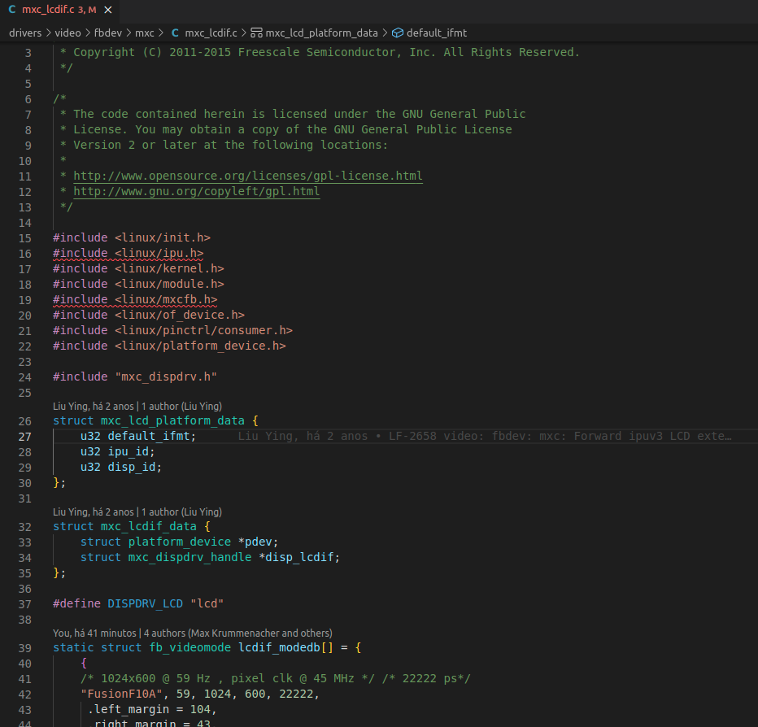
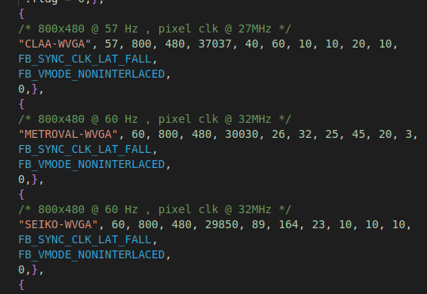
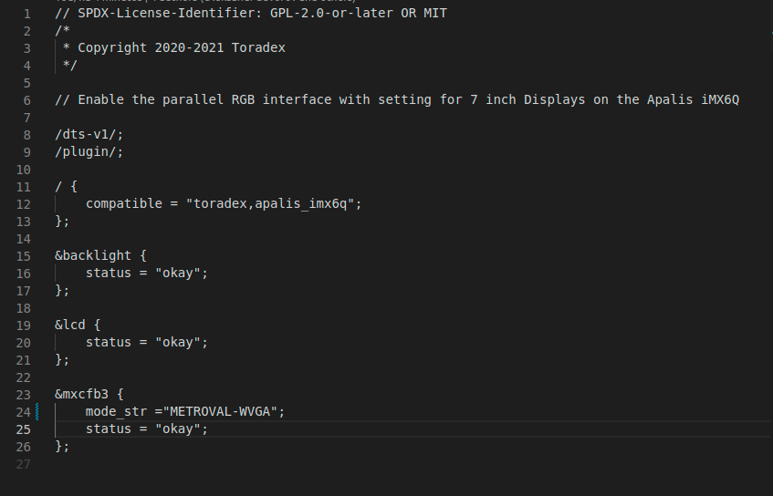

# Modificando as configurações de display na toradex IMX6
> Como mudar as especificações de exibição de display na toradex IMX6 com a BSP versão 5.
#

Durante o processo você irá adicionar um estrutura com as especificações do display na kernel, modificar uma Device tree Oveerlay(DTO) e compilar ambas.

## Pré-requisitos

### Preparar a Host para Cross-Compilação

-   Prepare o pc host com o GNU para a cross-compilação como indicado no [tutorial] da toradex. 

-   Instale o Device Tree Compiler(DTC), esta logo após o GNU no mesmo tutorial.

_Não esquecer de fazer os exports sempre que abrir um terminal novo._

#

## Configuração da Kernel
Baixe o source code da kernel usando git:

```bash
mkdir -p ~/workdir
cd ~/workdir
git clone -b (branch) git://git.toradex.com/linux-toradex.git
```

Substitua o (branch) pelo kernel Git Branch exata da placa que esta usando, no link [tutorial] é possivel encontrar a correta para sua placa.

### Setando a configuração da kernel padrão
```bash
cd ~/workdir/linux-toradex
make (defconfig)
```
Substitua o (defconfig) pela kernel Configuration da placa que esta usando tambem encontrada no [tutorial].

### Adicionando especificações

Adicione a estrutura com as especificações no driver de video do framebuffer. 

Abra o arquivo mxc_lcdif.c no editor de texto da sua escolha em /linux-toradex/drivers/video/fbdev/mxc/mcx_lcdif.c você deve encontrar algo assim:



Na struct fb_videomode adicione um modo com as especificações do seu display seguindo esta estrutura:

```c
struct fb_videomode {
const char *name;
u32 refresh; /* optional */
u32 xres;
u32 yres;
u32 pixclock;
u32 left_margin;
u32 right_margin;
u32 upper_margin;
u32 lower_margin;
u32 hsync_len;
u32 vsync_len;
u32 sync;
u32 vmode;
u32 flag;
};
```

Recomendo utilizar um dos modos como exemplo. A sua struct deve ficar parecida com esta:



Utilizarei a "METROVAL-WVGA" para os exemplos seguintes.
## Compilação da Kernel

Estarei utilizando como exemplo para a compilação a placa Apalis IMX6. No [tutorial] da toradex é possivel encontrar informações mais detalhadas sobre os outros modelos.

Para compilar a kernel e o device tree:

```bash
make -j$(nproc) zImage LOADADDR=10008000 2>&1 | tee build.log
make DTC_FLAGS="-@" (device-tree).dtb
```

Substitua o (device-tree) pela da placa que esta usando, no link [tutorial] é possivel encontrar a correta para sua placa.

A chamada $(nproc) é para a quantidade de nucleos do processador.

Com a imagem do kernel compilada recomendo que pegue a zImage, copie e mova para um local de facil acesso. A Zimafe deve estar em /workdir/linux-toradex/arch/arm/boot/zImage.
#
## Device Tree Overlays

As device tree overlays permitem modificar a device tree sem recompilar elas por inteiro.

Primeiramente baixe o codigo fonte da DTO com o git:
```bash
cd ~/workdir
git clone -b (branch) git://git.toradex.com/device-tree-overlays.git
cd device-tree-overlays/
cd overlays/
```
Substitua o (branch) pelo Device Tree Overlay Git Branch exata da placa que esta usando, no link [tutorial] é possivel encontrar a correta para sua placa no final da pagina.

### Modificando a DTO

Abra o arquivo da sua placa como pode ser visto em [overlays] no editor de texto da sua escolha, no caso da apalis imx6 fica em /device-tree-overlays/overlays/apalis-imx6_lcd-lt161010_overlay.dts. 

Você deve encontrar algo assim:



Troque o mode_str pelo nome da estrutura que você colocou no mxc, por exemplo "METROVAL-WVGA" neste caso.

### Compilando a DTO

Ainda na pasta ovelays set o path para a linux kernel utilizada:
```bash
export STAGING_KERNEL_DIR=/home/user/workdir/linux-toradex
make
```
Com a overlay que vc modificou compilada para um arquivo .dtbo recomendo copiar e mover para a mesma pasta da zImage.

#

## Trocando os arquivos e habilitando as configurações

Acesse o terminal do sistema que utiliza o display e substitua os arquivos de zImage em /boot/zImage e o .dtbo em /boot/ovelays

Antes de dar reboot é necessario alterar o overlays.txt que fica no /boot

Só alterar o arquivo como ensinado em [overlays] no topico Enable/Disable a Device Tree Overlay.

Após reboot o display deve estar funcionando.


[tutorial]: https://developer.toradex.com/linux-bsp/5.0/os-development/build-u-boot-and-linux-kernel-from-source-code/#32bitarm

[overlays]: https://developer.toradex.com/linux-bsp/5.0/os-development/build-yocto/device-tree-overlays-linux/#deploying-a-device-tree-overlay